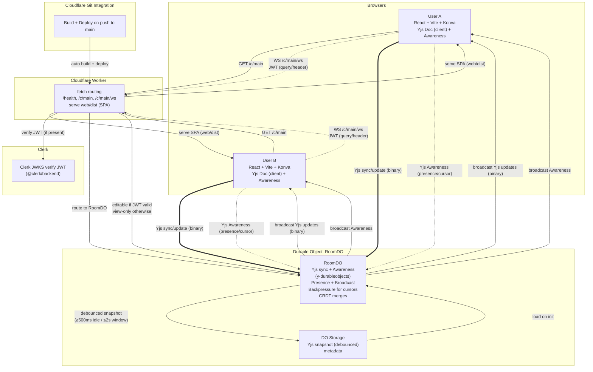

### CollabCanvas MVP — Architecture Overview

Key points
- Single room for MVP: `/c/main` → one `RoomDO` instance.
- Auth: Clerk JWT on WS upgrade; edit requires valid token; view-only for anonymous.
- Realtime: Yjs (sync/update) for document state; Awareness for presence/cursors (20 Hz throttle client-side).
- Persistence: DO storage holds debounced Yjs snapshot; restore on DO init.
- Backpressure: drop/merge stale Awareness frames; coalesce transforms.
- CI/CD: Cloudflare Git integration builds/deploys on push to `main`.
