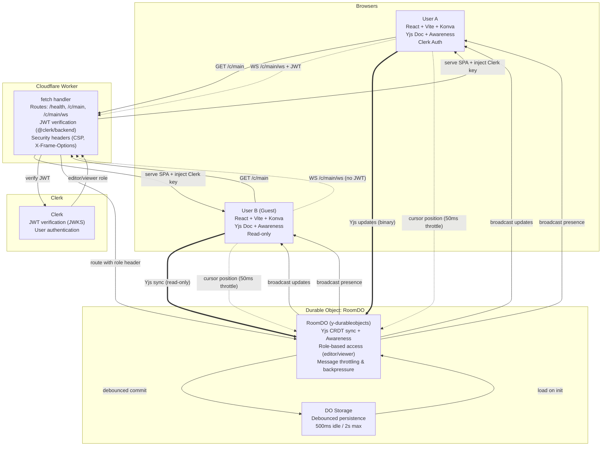

# CollabCanvas MVP — Architecture Overview

## System Architecture



## Components

### Frontend (`web/`)

**Tech Stack:**
- React 18 (StrictMode in dev only)
- Konva + react-konva (canvas rendering)
- Yjs + y-websocket (CRDT sync)
- Clerk (authentication)
- Vite (build tool)

**Key Modules:**

1. **`main.tsx`**: Entry point, Clerk + Yjs providers
2. **`yjs/client.tsx`**: WebSocket provider, connection management, online/offline handling
3. **`hooks/`**:
   - `usePresence.ts`: Cursor positions, user colors, display names (sanitized)
   - `useToolbar.tsx`: Shared canvas tool state (Select/Rectangle)
4. **`shapes/`**:
   - `types.ts`: Shape type definitions, factory functions
   - `useShapes.ts`: Yjs Y.Map ↔ React state sync, CRUD operations
   - `ShapeLayer.tsx`: Renders shapes, handles drag/resize/rotate
5. **`ui/`**:
   - `App.tsx`: Main layout, loading overlay, connection status
   - `Canvas.tsx`: Konva Stage, pan/zoom, grid, input handling
   - `Toolbar.tsx`: Tool selection (with auth-aware disabling)
   - `PresenceBar.tsx`: Active users list

**Features:**
- ✅ Real-time shape creation (rectangles)
- ✅ Drag to move, resize handles, rotation
- ✅ Pan (drag in select mode) & zoom (mouse wheel)
- ✅ Grid background (scales with zoom)
- ✅ Cursor presence with name labels
- ✅ Edge indicators for off-screen cursors
- ✅ Offline support (auto-reconnect, changes buffered)
- ✅ Guest mode (read-only, can pan/zoom)
- ✅ Delete shapes (Delete/Backspace key)
- ✅ Responsive canvas (fills viewport)

### Backend (`src/`)

**Tech Stack:**
- Cloudflare Workers (edge compute)
- Durable Objects (stateful WebSocket coordination)
- y-durableobjects (Yjs persistence)
- @clerk/backend (JWT verification)

**Key Modules:**

1. **`worker.ts`**: Main fetch handler
   - Routes: `/health`, `/clerk/config`, `/c/main` (SPA), `/c/main/ws` (WebSocket)
   - JWT extraction and verification
   - WebSocket route parsing and validation
   - Security headers (CSP, X-Frame-Options, X-Content-Type-Options)

2. **`room-do.ts`**: Durable Object for collaboration
   - Extends `YDurableObjects` from y-durableobjects
   - Role-based message filtering (viewers can't send updates)
   - Debounced persistence (500ms idle, 2s max)
   - Automatic cleanup on disconnect

3. **`utils/debounced-storage.ts`**: Debounced commit controller
   - Coalesces rapid updates
   - Ensures data is persisted within time bounds

**Security:**
- ✅ JWT verification for all authenticated requests
- ✅ CSP headers to prevent XSS
- ✅ X-Frame-Options: DENY (prevent clickjacking)
- ✅ Display name sanitization (remove HTML chars, limit length)
- ✅ Role-based edit gating at protocol level

## Data Flow

### Shape Creation Flow

1. **User clicks + drags on canvas**
   - `Canvas.tsx` captures mouse events
   - Live preview (dashed rectangle) during drag

2. **On mouse up**
   - `createRectangle()` generates shape with unique ID
   - `useShapes.createShape()` inserts into Yjs Y.Map
   - Shape serialized to plain JSON

3. **Yjs sync**
   - Update broadcast to DO via WebSocket
   - DO applies update to shared Yjs doc
   - DO broadcasts to all connected clients
   - Other clients' Y.Map.observe() fires → React re-renders

4. **Persistence**
   - Debounced commit scheduler triggered
   - After 500ms idle (or 2s max), DO calls `storage.commit()`
   - Yjs state snapshot saved to Durable Object storage

### Cursor Presence Flow

1. **Mouse move on canvas**
   - `Canvas.tsx` captures pointer position
   - Adjusts coordinates for zoom/pan (canvas-space)
   - Throttled to 50ms (20 updates/sec max)

2. **Awareness update**
   - `setPresence()` updates local awareness state
   - Yjs awareness protocol broadcasts to DO
   - DO relays to other clients (viewers and editors)

3. **Rendering**
   - Remote clients' `usePresence()` hook observes awareness changes
   - `Canvas.tsx` renders cursor dots + name labels
   - Labels scale inverse to zoom (stay readable)
   - Edge indicators for off-screen cursors

### Authentication Flow

1. **User signs in**
   - Clerk modal authentication
   - JWT token obtained from Clerk

2. **WebSocket upgrade**
   - Frontend passes JWT as query parameter
   - Worker extracts token, verifies with Clerk JWKS
   - If valid → `editor` role, else → `viewer` role
   - Role passed to DO via `x-collabcanvas-role` header

3. **Message filtering**
   - DO checks role for each Yjs sync message
   - Viewers: Awareness allowed, document updates blocked
   - Editors: Full access to document + awareness

## Performance

### Throttling

- **Cursor updates**: 50ms (20 msgs/sec)
- **Shape drag updates**: 50ms during drag
- **Transform updates**: 50ms during resize/rotate
- **Total**: Well under 30 msgs/sec per client target

### Persistence

- **Idle threshold**: 500ms (commit after inactivity)
- **Max threshold**: 2s (force commit)
- **Strategy**: Debounced with `waitUntil()` for cleanup

### Rendering

- **Target**: 60 FPS
- **Konva optimizations**: Layer-based rendering, event delegation
- **Grid**: Dynamically calculated visible cells only
- **Zoom**: CSS transform with smooth easing

## Testing

**Test Files:** 5 files, 20 tests

1. **`src/index.test.ts`**: Basic smoke tests
2. **`src/worker.test.ts`**: Route parsing, token extraction, security headers
3. **`src/room-do.test.ts`**: Durable Object persistence and role enforcement
4. **`src/utils/debounced-storage.test.ts`**: Debounce logic, idle/max thresholds
5. **`web/src/shapes/types.test.ts`**: Shape creation, validation, type guards

**Coverage:**
- ✅ Worker routing and JWT extraction
- ✅ Durable Object persistence
- ✅ Debounced storage logic
- ✅ Shape type system
- ⚠️ Frontend: No unit tests (would require React Testing Library setup)

## Deployment

### Cloudflare Workers

**Configuration** (`wrangler.toml`):
- Custom domain: `canvas.adamwhite.work`
- Durable Object: `RoomDO`
- Assets: `web/dist` (SPA)
- Env vars: `CLERK_PUBLISHABLE_KEY`
- Secrets: `CLERK_SECRET_KEY` (set via `wrangler secret put`)

**Build Process:**
```bash
npm run build
# 1. npm --prefix web ci (install frontend deps)
# 2. npm --prefix web run build (build SPA → web/dist)
# 3. tsc -p tsconfig.json (typecheck worker)
```

**Deploy:**
```bash
npm run deploy
# Deploys worker + DO to Cloudflare edge
```

### Bundle Sizes

- **Frontend**: 703.80 kB (214.42 kB gzipped)
  - React + Konva + Yjs + Clerk: Large but acceptable for MVP
- **Worker**: 416.67 kB (82.81 kB gzipped)
  - Well within Cloudflare limits

## Future Enhancements

**MVP Completed**, potential future work:

1. **More shapes**: Circles, lines, text, images
2. **Styling**: Fill color, stroke width, opacity pickers
3. **Layers**: Z-index management, bring to front/back
4. **Selection**: Multi-select, group operations
5. **Undo/Redo**: Yjs history plugin
6. **Rooms**: Multi-room support (already architected for it)
7. **Permissions**: Fine-grained role system (owner, editor, commenter, viewer)
8. **Export**: PNG/SVG export
9. **Performance**: Code splitting, dynamic imports
10. **Testing**: Frontend unit/integration tests

## Key Decisions

**Why Yjs?**
- CRDT with proven conflict resolution
- Built-in awareness protocol (no custom presence needed)
- Efficient binary encoding
- Active ecosystem

**Why Cloudflare + Durable Objects?**
- Global edge deployment (low latency)
- Stateful WebSocket coordination
- Automatic scaling
- y-durableobjects integration

**Why Konva?**
- Mature canvas library with React bindings
- Transform operations built-in
- Good performance for 100s of shapes
- Lower risk than tldraw (custom Yjs bindings needed)

**Why Clerk?**
- Drop-in authentication
- JWT verification with JWKS
- Guest mode support
- Production-ready

---

**Document Version**: 1.0 (Final MVP)  
**Last Updated**: January 2025  
**Status**: ✅ Production Ready
