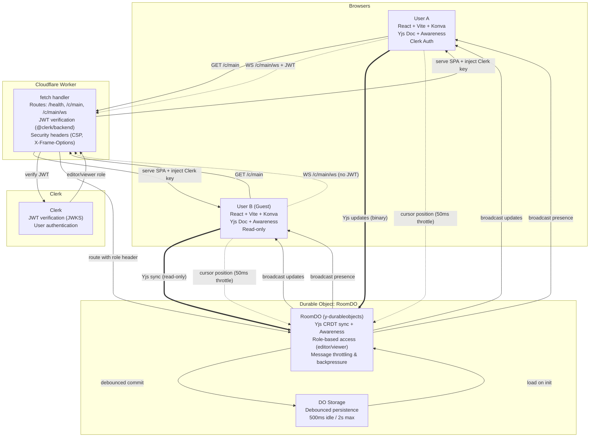

# CollabCanvas MVP — Architecture Overview

## System Architecture



## Components

### Frontend (`web/`)

**Tech Stack:**
- React 18 (StrictMode in dev only)
- Konva + react-konva (canvas rendering)
- Yjs + y-websocket (CRDT sync)
- Clerk (authentication)
- Vite (build tool)

**Key Modules:**

1. **`main.tsx`**: Entry point, Clerk + Yjs providers
2. **`yjs/client.tsx`**: WebSocket provider, connection management, online/offline handling
3. **`hooks/`**:
   - `usePresence.ts`: Cursor positions, user colors, display names (sanitized)
   - `useToolbar.tsx`: Shared canvas tool state (Select/Rectangle)
4. **`shapes/`**:
   - `types.ts`: Shape type definitions, factory functions
   - `useShapes.ts`: Yjs Y.Map ↔ React state sync, CRUD operations
   - `ShapeLayer.tsx`: Renders shapes, handles drag/resize/rotate
5. **`ui/`**:
   - `App.tsx`: Main layout, loading overlay, connection status
   - `Canvas.tsx`: Konva Stage, pan/zoom, grid, input handling
   - `Toolbar.tsx`: Tool selection (with auth-aware disabling)
   - `PresenceBar.tsx`: Active users list

**Features:**
- ✅ Real-time shape creation (rectangles)
- ✅ Drag to move, resize handles, rotation
- ✅ Pan (drag in select mode) & zoom (mouse wheel)
- ✅ Grid background (scales with zoom)
- ✅ Cursor presence with name labels
- ✅ Edge indicators for off-screen cursors
- ✅ Offline support (auto-reconnect, changes buffered)
- ✅ Guest mode (read-only, can pan/zoom)
- ✅ Delete shapes (Delete/Backspace key)
- ✅ Responsive canvas (fills viewport)

### Backend (`src/`)

**Tech Stack:**
- Cloudflare Workers (edge compute)
- Durable Objects (stateful WebSocket coordination)
- y-durableobjects (Yjs persistence)
- @clerk/backend (JWT verification)

**Key Modules:**

1. **`worker.ts`**: Main fetch handler
   - Routes: `/health`, `/clerk/config`, `/c/main` (SPA), `/c/main/ws` (WebSocket)
   - JWT extraction and verification
   - WebSocket route parsing and validation
   - Security headers (CSP, X-Frame-Options, X-Content-Type-Options)

2. **`room-do.ts`**: Durable Object for collaboration
   - Extends `YDurableObjects` from y-durableobjects
   - Role-based message filtering (viewers can't send updates)
   - Debounced persistence (500ms idle, 2s max)
   - Automatic cleanup on disconnect

3. **`utils/debounced-storage.ts`**: Debounced commit controller
   - Coalesces rapid updates
   - Ensures data is persisted within time bounds

**Security:**
- ✅ JWT verification for all authenticated requests
- ✅ CSP headers to prevent XSS
- ✅ X-Frame-Options: DENY (prevent clickjacking)
- ✅ Display name sanitization (remove HTML chars, limit length)
- ✅ Role-based edit gating at protocol level

## Data Flow

### Shape Creation Flow

1. **User clicks + drags on canvas**
   - `Canvas.tsx` captures mouse events
   - Live preview (dashed rectangle) during drag

2. **On mouse up**
   - `createRectangle()` generates shape with unique ID
   - `useShapes.createShape()` inserts into Yjs Y.Map
   - Shape serialized to plain JSON

3. **Yjs sync**
   - Update broadcast to DO via WebSocket
   - DO applies update to shared Yjs doc
   - DO broadcasts to all connected clients
   - Other clients' Y.Map.observe() fires → React re-renders

4. **Persistence**
   - Debounced commit scheduler triggered
   - After 500ms idle (or 2s max), DO calls `storage.commit()`
   - Yjs state snapshot saved to Durable Object storage

### Cursor Presence Flow

1. **Mouse move on canvas**
   - `Canvas.tsx` captures pointer position
   - Adjusts coordinates for zoom/pan (canvas-space)
   - Throttled to 50ms (20 updates/sec max)

2. **Awareness update**
   - `setPresence()` updates local awareness state
   - Yjs awareness protocol broadcasts to DO
   - DO relays to other clients (viewers and editors)

3. **Rendering**
   - Remote clients' `usePresence()` hook observes awareness changes
   - `Canvas.tsx` renders cursor dots + name labels
   - Labels scale inverse to zoom (stay readable)
   - Edge indicators for off-screen cursors

### Authentication Flow

1. **User signs in**
   - Clerk modal authentication
   - JWT token obtained from Clerk

2. **WebSocket upgrade**
   - Frontend passes JWT as query parameter
   - Worker extracts token, verifies with Clerk JWKS
   - If valid → `editor` role, else → `viewer` role
   - Role passed to DO via `x-collabcanvas-role` header

3. **Message filtering**
   - DO checks role for each Yjs sync message
   - Viewers: Awareness allowed, document updates blocked
   - Editors: Full access to document + awareness

## Performance

### Throttling

- **Cursor updates**: 50ms (20 msgs/sec)
- **Shape drag updates**: 50ms during drag
- **Transform updates**: 50ms during resize/rotate
- **Total**: Well under 30 msgs/sec per client target

### Persistence

- **Idle threshold**: 500ms (commit after inactivity)
- **Max threshold**: 2s (force commit)
- **Strategy**: Debounced with `waitUntil()` for cleanup

### Rendering

- **Target**: 60 FPS
- **Konva optimizations**: Layer-based rendering, event delegation
- **Grid**: Dynamically calculated visible cells only
- **Zoom**: CSS transform with smooth easing

## Testing

**Test Files:** 5 files, 20 tests

1. **`src/index.test.ts`**: Basic smoke tests
2. **`src/worker.test.ts`**: Route parsing, token extraction, security headers
3. **`src/room-do.test.ts`**: Durable Object persistence and role enforcement
4. **`src/utils/debounced-storage.test.ts`**: Debounce logic, idle/max thresholds
5. **`web/src/shapes/types.test.ts`**: Shape creation, validation, type guards

**Coverage:**
- ✅ Worker routing and JWT extraction
- ✅ Durable Object persistence
- ✅ Debounced storage logic
- ✅ Shape type system
- ⚠️ Frontend: No unit tests (would require React Testing Library setup)

## Deployment

### Cloudflare Workers

**Configuration** (`wrangler.toml`):
- Custom domain: `canvas.adamwhite.work`
- Durable Object: `RoomDO`
- Assets: `web/dist` (SPA)
- Env vars: `CLERK_PUBLISHABLE_KEY`
- Secrets: `CLERK_SECRET_KEY` (set via `wrangler secret put`)

**Build Process:**
```bash
npm run build
# 1. npm --prefix web ci (install frontend deps)
# 2. npm --prefix web run build (build SPA → web/dist)
# 3. tsc -p tsconfig.json (typecheck worker)
```

**Deploy:**
```bash
npm run deploy
# Deploys worker + DO to Cloudflare edge
```

### Bundle Sizes

- **Frontend**: 703.80 kB (214.42 kB gzipped)
  - React + Konva + Yjs + Clerk: Large but acceptable for MVP
- **Worker**: 416.67 kB (82.81 kB gzipped)
  - Well within Cloudflare limits

## Conflict Resolution & State Management

### Overview

CollabCanvas uses a **hybrid conflict resolution strategy** combining Yjs CRDT for data consistency with **optimistic locking via Awareness** for edit conflict prevention. This provides both strong eventual consistency and real-time collaboration UX.

### Conflict Resolution Strategy

#### 1. Selection-Based Object Locking

**Mechanism**: Ephemeral locks via Yjs Awareness (per-user state)

- **Lock Acquisition**: When a user selects shape(s), their client broadcasts locks via Awareness
- **Lock Data**: `{ userId, displayName, color, lockedShapeIds: string[], lockTimestamp }`
- **Lock Release**: Automatic on deselection or user disconnect (Awareness cleanup)
- **Lock Timeout**: 30-second stale lock cleanup prevents orphaned locks from crashes

**Visual Feedback**:
- Locked shapes show colored outline matching lock holder's presence color
- Hover tooltip displays: "🔒 {userName} is editing"
- Selection attempts on locked shapes are blocked (no feedback to prevent confusion)

**First-to-Select Wins**:
- User A selects shape → broadcasts lock → other users see locked state
- User B tries to select same shape → selection blocked (lock check in `onShapeSelect`)
- User A deselects → lock released → shape becomes available

#### 2. Transform Conflict Prevention

**Throttled Updates with Lock Validation**:
- Transform operations (drag/resize/rotate) broadcast at 50ms intervals (20 updates/sec)
- Only lock holder can broadcast transform updates for locked shapes
- Other users receive updates but cannot interact with locked shapes
- Final transform always sent on mouseup (ensures consistency)

**Group Operations**:
- Multi-select locks all selected shapes atomically
- Group drag/transform maintains relative positions
- All shapes in selection move together (single transaction)

#### 3. CRDT-Based Data Consistency

**Yjs CRDT Handles**:
- Concurrent shape creation (unique IDs prevent collisions)
- Last-write-wins for shape properties (Yjs merges concurrent edits)
- Automatic conflict resolution for network partitions
- Guaranteed eventual consistency across all clients

**Atomic Operations**:
- All AI commands execute in single Yjs transaction
- Multi-shape operations (group delete, batch create) are atomic
- Prevents partial updates and flicker

### Rubric Test Scenarios

#### Scenario 1: Simultaneous Move
**Setup**: Users A and B both try to drag the same rectangle

**Resolution**:
1. User A clicks rectangle → acquires lock → broadcasts via Awareness
2. User B sees locked state (colored outline, cursor shows lock holder)
3. User B's click on locked shape is blocked (no selection change)
4. User A drags → only A's transform updates are broadcast
5. User A releases → lock removed → shape becomes available
6. User B can now select and drag

**Outcome**: No conflicting updates, clean handoff, both users see consistent state

#### Scenario 2: Rapid Edit Storm
**Setup**: User A resizes, User B changes color, User C moves

**Resolution**:
1. User A selects shape → acquires lock
2. User B tries to select for color change → blocked (shape locked)
3. User C tries to drag → blocked (shape locked)
4. User A completes resize → releases lock
5. User B or C (whoever clicks first) acquires lock → can edit
6. Yjs CRDT merges property changes (last write wins for each property)

**Outcome**: Sequential edits enforced by locks, no data loss, eventual consistency

#### Scenario 3: Delete vs Edit
**Setup**: User A deletes shape while User B is editing it

**Resolution**:
1. User B has lock and is actively transforming shape
2. User A cannot select locked shape → cannot delete via UI
3. **Edge case**: User A uses keyboard shortcut or API to force delete
   - Delete operation succeeds (Yjs removes from Y.Map)
   - User B's transform updates now target non-existent shape (ignored)
   - User B sees shape disappear immediately (Yjs sync)
   - User B's selection auto-clears (shape no longer in shapes array)

**Outcome**: Delete wins, editor sees visual feedback, no errors

#### Scenario 4: Create Collision
**Setup**: Two users create shapes at the exact same timestamp

**Resolution**:
1. Both users generate unique IDs (`crypto.randomUUID()`)
2. Both inserts sent to Yjs Y.Map with different keys
3. Yjs CRDT merges both operations (no collision, both shapes exist)
4. All users see both shapes appear simultaneously

**Outcome**: Both creates succeed with unique IDs, no conflicts

### Implementation Details

**Lock Checking (per shape)**:
```typescript
// In Canvas.tsx onShapeSelect
if (locking.isShapeLocked(shapeId, userId)) {
  return; // Block selection
}

// In ShapeLayer.tsx render
const lockOwner = locking.getLockOwner(shape.id);
const isLockedByOther = lockOwner !== null && lockOwner.userId !== userId;
const isDraggable = canEdit && selectedTool === "select" && !isLockedByOther;
```

**Lock Broadcasting (on selection change)**:
```typescript
// In Canvas.tsx useEffect
useEffect(() => {
  if (canEdit) {
    locking.updateLocks(selectedShapeIds);
  }
}, [selectedShapeIds, canEdit]);
```

**Stale Lock Cleanup**:
```typescript
// In useLocking.ts
const STALE_LOCK_TIMEOUT_MS = 30000; // 30 seconds

// Filter out locks older than timeout when building lockedShapes map
const lockAge = state.lockTimestamp ? now - state.lockTimestamp : 0;
if (lockAge > STALE_LOCK_TIMEOUT_MS) continue;
```

### Limitations & Trade-offs

**Intentional Design Choices**:
1. **No lock stealing**: Once locked, only lock holder can release (prevents disruption)
2. **Selection-based locking only**: Text editing within shapes uses last-write-wins
3. **Awareness-based (ephemeral)**: Locks don't persist across page refresh (intentional - prevents stale locks)
4. **No server-side validation**: Lock enforcement is client-side (trust model, reduces latency)

**Known Edge Cases**:
1. **Network partition**: Users disconnected from DO don't receive lock updates until reconnection
2. **Clock skew**: Lock timestamps rely on client clocks (30s timeout provides buffer)
3. **Rapid reconnection**: User may briefly see own locks as "stale" until Awareness syncs

### Performance Characteristics

**Message Rates** (per client):
- Cursor updates: 20/sec (50ms throttle)
- Transform updates: 20/sec (50ms throttle)
- Lock updates: On selection change only (not throttled, infrequent)
- Total: ~40 msgs/sec per active client (well within Cloudflare DO limits)

**Lock Lookup Performance**:
- O(1) hash map lookup per shape
- Map rebuilt from Awareness on each change (acceptable for <100 users)
- Could optimize with incremental updates if needed for 100+ concurrent users

## Future Enhancements

**Post-MVP Completed Features**:
1. ✅ **Multiple shape types**: Rectangle, circle, text
2. ✅ **Multi-select & lasso selection**: Group operations, Shift+Click
3. ✅ **Object locking**: Conflict prevention via Awareness
4. ⏳ **Undo/Redo**: Yjs UndoManager integration (in progress)
5. ⏳ **Advanced features**: Color picker, copy/paste, keyboard shortcuts (in progress)

**Future Work**:
1. **Layers**: Z-index management, bring to front/back
2. **Rooms**: Multi-room support (already architected for it)
3. **Export**: PNG/SVG export
4. **Performance**: Code splitting, dynamic imports
5. **Testing**: Frontend unit/integration tests

## Key Decisions

**Why Yjs?**
- CRDT with proven conflict resolution
- Built-in awareness protocol (no custom presence needed)
- Efficient binary encoding
- Active ecosystem

**Why Cloudflare + Durable Objects?**
- Global edge deployment (low latency)
- Stateful WebSocket coordination
- Automatic scaling
- y-durableobjects integration

**Why Konva?**
- Mature canvas library with React bindings
- Transform operations built-in
- Good performance for 100s of shapes
- Lower risk than tldraw (custom Yjs bindings needed)

**Why Clerk?**
- Drop-in authentication
- JWT verification with JWKS
- Guest mode support
- Production-ready

---

**Document Version**: 1.0 (Final MVP)  
**Last Updated**: January 2025  
**Status**: ✅ Production Ready
